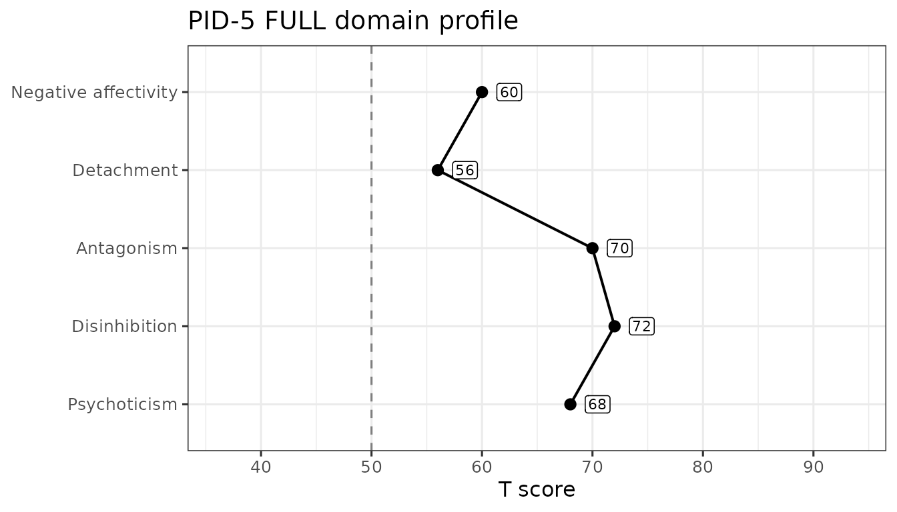
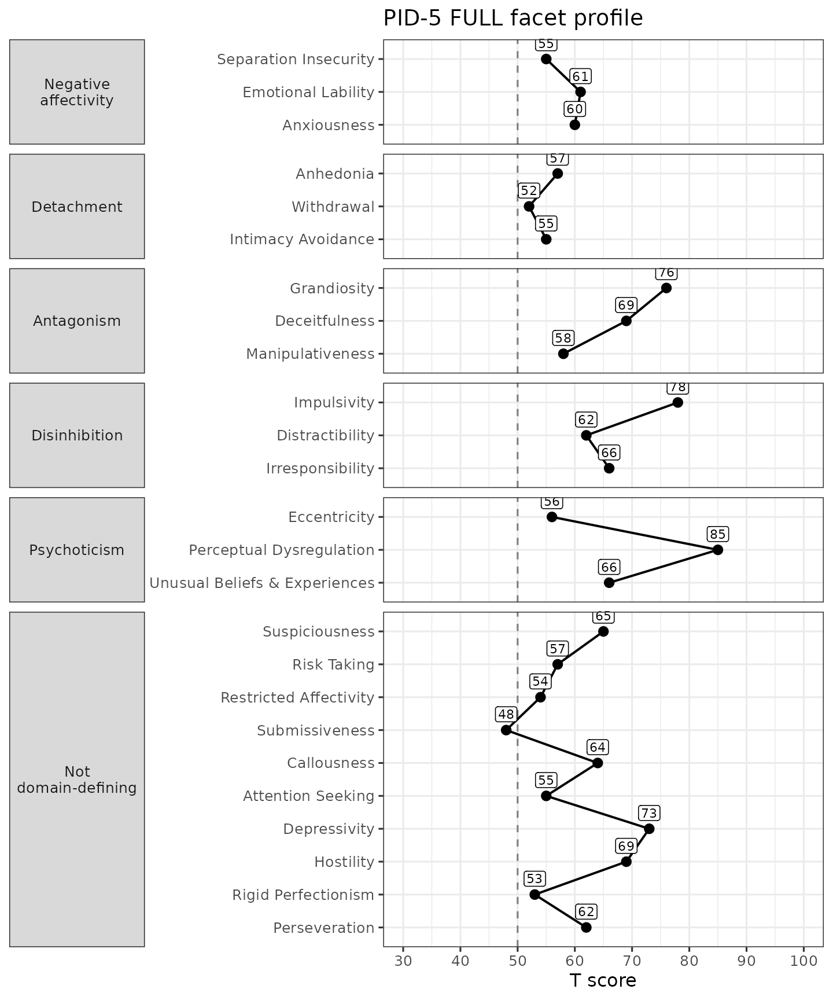
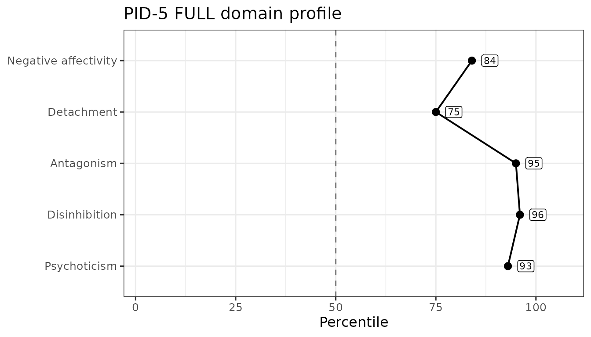

# Scoring the PID-5

The Personality Inventory for DSM-5 (PID-5) instrument has 220 items and
yields 25 facet scales, 5 domain scales, and 5 validity scales. We can
demonstrate the package’s functionality using some simulated data.

First, we load the package into memory using the
[`library()`](https://rdrr.io/r/base/library.html) function. If this
doesn’t work, make sure you installed the package properly (see the
README on [GitHub](https://github.com/jmgirard/hitop)).

``` r

library(hitop)
```

## Score simulated PID-5 data

The `sim_pid5` dataset is built into the package and can be loaded using
the [`data()`](https://rdrr.io/r/utils/data.html) function. It contains
100 rows (each representing a simulated participant) and 220 columns
named `pid5_001` to `pid5_220` (each representing an item from the
PID-5).

``` r

data("sim_pid5")
sim_pid5
#> # A tibble: 100 × 220
#>    pid5_001 pid5_002 pid5_003 pid5_004 pid5_005 pid5_006 pid5_007 pid5_008
#>       <int>    <int>    <int>    <int>    <int>    <int>    <int>    <int>
#>  1        0        3        2        1        1        3        1        3
#>  2        3        3        0        3        0        3        2        2
#>  3        3        2        3        2        3        3        0        3
#>  4        1        3        0        2        1        0        2        0
#>  5        0        1        3        2        3        1        0        1
#>  6        2        1        1        3        3        2        2        0
#>  7        1        1        3        3        1        3        1        0
#>  8        2        0        3        0        3        2        0        1
#>  9        1        1        3        0        1        1        2        3
#> 10        0        3        2        3        3        0        1        2
#> # ℹ 90 more rows
#> # ℹ 212 more variables: pid5_009 <int>, pid5_010 <int>, pid5_011 <int>,
#> #   pid5_012 <int>, pid5_013 <int>, pid5_014 <int>, pid5_015 <int>,
#> #   pid5_016 <int>, pid5_017 <int>, pid5_018 <int>, pid5_019 <int>,
#> #   pid5_020 <int>, pid5_021 <int>, pid5_022 <int>, pid5_023 <int>,
#> #   pid5_024 <int>, pid5_025 <int>, pid5_026 <int>, pid5_027 <int>,
#> #   pid5_028 <int>, pid5_029 <int>, pid5_030 <int>, pid5_031 <int>, …
```

If your own PID-5 columns are named some other way,
[`rename_pid5_items()`](https://jmgirard.github.io/hitop/reference/rename_pid5_items.md)
will rename them to this pattern. By default it reads the item number
out of a column already named `pid_1`, `pid_2` and so on – the spelling
this package’s own datasets used before they were renamed to match the
exports. Setting `method = "text"` instead matches the literal item
prompts. Columns it cannot match keep their names and are reported, and
a partial rename warns that fewer than 220 items were matched, which
suits a study that administered only some of them.

``` r

old_names <- data.frame(pid_1 = c(0, 1), pid_2 = c(2, 3), age = c(30, 40))

rename_pid5_items(old_names, version = "FULL")
#> Warning: Only 2 out of 220 PID-5 items were successfully matched and renamed.
#> ℹ Note: If you plan to use `score_pid5()`, ensure uncollected items exist in
#>   the data frame as `NA` columns.
#>   pid5_001 pid5_002 age
#> 1        0        2  30
#> 2        1        3  40
```

[`label_pid5()`](https://jmgirard.github.io/hitop/reference/label_pid5.md)
is the companion helper: it attaches each item’s questionnaire prompt to
that item’s column as a `label` attribute, which data viewers and
reporting packages can display in place of the column name. With
`target = "scales"` it does the same for the columns
[`score_pid5()`](https://jmgirard.github.io/hitop/reference/score_pid5.md)
writes, attaching each facet and domain its display name.

``` r

labeled <- label_pid5(sim_pid5, target = "items", version = "FULL")

attr(labeled$pid5_001, "label")
#> [1] "I don't get as much pleasure out of things as others seem to"
```

To turn these item-level data into scale scores on the 25 facets and 5
domains, we can use the
[`score_pid5()`](https://jmgirard.github.io/hitop/reference/score_pid5.md)
function. We will need to tell the function which columns contain our
items and which version of the PID this is. There are several ways we
can specify the items. First, we can provide the column numbers and use
the `:` shortcut. In this tibble, the items are from column 1 to column
220 so we can use `items = 1:220`. I am going to also set
`append = FALSE` so that you can quickly see the scale scores. I also
can set the version to `"FULL"` (or leave that argument off, as that is
the default, shown in the example below) to let it know we are using the
full 220-item version.

``` r

scores <- score_pid5(sim_pid5, items = 1:220, version = "FULL", append = FALSE)
scores
#> # A tibble: 100 × 30
#>    pid_anhedonia pid_suspiciousness pid_riskTaking pid_impulsivity
#>            <dbl>              <dbl>          <dbl>           <dbl>
#>  1          1.25               1.71           1.36           2.33 
#>  2          1.38               1.57           1.43           2    
#>  3          1.88               1              1.29           1.83 
#>  4          1.25               2.43           1.21           1.5  
#>  5          1.12               1.57           1.64           2.5  
#>  6          2.12               1              1.79           1.83 
#>  7          1.38               1.14           1.86           1.17 
#>  8          1.5                1.71           1.86           0.667
#>  9          1.12               1.14           1.86           1.67 
#> 10          1.38               1.86           2.07           2    
#> # ℹ 90 more rows
#> # ℹ 26 more variables: pid_eccentricity <dbl>, pid_distractibility <dbl>,
#> #   pid_restrictedAffectivity <dbl>, pid_submissiveness <dbl>,
#> #   pid_withdrawal <dbl>, pid_callousness <dbl>,
#> #   pid_separationInsecurity <dbl>, pid_attentionSeeking <dbl>,
#> #   pid_emotionalLability <dbl>, pid_depressivity <dbl>, pid_hostility <dbl>,
#> #   pid_irresponsibility <dbl>, pid_rigidPerfectionism <dbl>, …
```

If I had instead set `append = TRUE` (or left it off, as that is the
default), we would get back the `sim_pid5` tibble with the scale scores
added to the end as extra columns. Notice below how we now have 250
columns instead of 220 or 30.

``` r

scores <- score_pid5(sim_pid5, items = 1:220)
scores
#> # A tibble: 100 × 250
#>    pid5_001 pid5_002 pid5_003 pid5_004 pid5_005 pid5_006 pid5_007 pid5_008
#>       <int>    <int>    <int>    <int>    <int>    <int>    <int>    <int>
#>  1        0        3        2        1        1        3        1        3
#>  2        3        3        0        3        0        3        2        2
#>  3        3        2        3        2        3        3        0        3
#>  4        1        3        0        2        1        0        2        0
#>  5        0        1        3        2        3        1        0        1
#>  6        2        1        1        3        3        2        2        0
#>  7        1        1        3        3        1        3        1        0
#>  8        2        0        3        0        3        2        0        1
#>  9        1        1        3        0        1        1        2        3
#> 10        0        3        2        3        3        0        1        2
#> # ℹ 90 more rows
#> # ℹ 242 more variables: pid5_009 <int>, pid5_010 <int>, pid5_011 <int>,
#> #   pid5_012 <int>, pid5_013 <int>, pid5_014 <int>, pid5_015 <int>,
#> #   pid5_016 <int>, pid5_017 <int>, pid5_018 <int>, pid5_019 <int>,
#> #   pid5_020 <int>, pid5_021 <int>, pid5_022 <int>, pid5_023 <int>,
#> #   pid5_024 <int>, pid5_025 <int>, pid5_026 <int>, pid5_027 <int>,
#> #   pid5_028 <int>, pid5_029 <int>, pid5_030 <int>, pid5_031 <int>, …
```

Alternatively, we could provide the item column names as a character
string. Typing out all 220 item names would be a hassle, but luckily
this data named them consistently so we can build the names
automatically using [`sprintf()`](https://rdrr.io/r/base/sprintf.html).
If we use the “pid5\_%03d” format and apply that across the numbers 1 to
220, that will create the column names we need.

``` r

scores <- score_pid5(sim_pid5, items = sprintf("pid5_%03d", 1:220))
scores
#> # A tibble: 100 × 250
#>    pid5_001 pid5_002 pid5_003 pid5_004 pid5_005 pid5_006 pid5_007 pid5_008
#>       <int>    <int>    <int>    <int>    <int>    <int>    <int>    <int>
#>  1        0        3        2        1        1        3        1        3
#>  2        3        3        0        3        0        3        2        2
#>  3        3        2        3        2        3        3        0        3
#>  4        1        3        0        2        1        0        2        0
#>  5        0        1        3        2        3        1        0        1
#>  6        2        1        1        3        3        2        2        0
#>  7        1        1        3        3        1        3        1        0
#>  8        2        0        3        0        3        2        0        1
#>  9        1        1        3        0        1        1        2        3
#> 10        0        3        2        3        3        0        1        2
#> # ℹ 90 more rows
#> # ℹ 242 more variables: pid5_009 <int>, pid5_010 <int>, pid5_011 <int>,
#> #   pid5_012 <int>, pid5_013 <int>, pid5_014 <int>, pid5_015 <int>,
#> #   pid5_016 <int>, pid5_017 <int>, pid5_018 <int>, pid5_019 <int>,
#> #   pid5_020 <int>, pid5_021 <int>, pid5_022 <int>, pid5_023 <int>,
#> #   pid5_024 <int>, pid5_025 <int>, pid5_026 <int>, pid5_027 <int>,
#> #   pid5_028 <int>, pid5_029 <int>, pid5_030 <int>, pid5_031 <int>, …
```

There are other useful arguments to the function that you can read about
using its documentation by typing the following into your R console:
[`?score_pid5`](https://jmgirard.github.io/hitop/reference/score_pid5.md)
or through the [package
website](https://jmgirard.github.io/hitop/reference/score_pid5.html).

## Rank Each Person’s Highest Facets

Thirty scale columns is more than can be read at a glance. The
[`rank_scales()`](https://jmgirard.github.io/hitop/reference/rank_scales.md)
function condenses them: for each row it sorts the columns you select
and returns a single string naming the highest-scoring ones, highest
first. Here we rank the 25 facet scales — the first 25 columns of the
scored tibble, the last 5 being the domains those facets roll up into —
and ask for each participant’s top 5. Setting `prefix = "pid_"` strips
that leading string from the column names, so the string reads as scale
names.

``` r

facet_scores <- score_pid5(sim_pid5, items = 1:220, append = FALSE)
rank_scales(facet_scores, scales = 1:25, prefix = "pid_", top = 5, append = FALSE)
#> # A tibble: 100 × 1
#>    top_scales                                                                   
#>    <chr>                                                                        
#>  1 impulsivity,grandiosity,hostility,perceptualDysregulation,suspiciousness     
#>  2 distractibility,rigidPerfectionism,impulsivity,attentionSeeking,withdrawal   
#>  3 submissiveness,depressivity,anhedonia,eccentricity,impulsivity               
#>  4 suspiciousness,withdrawal,hostility,intimacyAvoidance,callousness            
#>  5 impulsivity,attentionSeeking,perseveration,perceptualDysregulation,distracti…
#>  6 distractibility,eccentricity,deceitfulness,separationInsecurity,anhedonia    
#>  7 rigidPerfectionism,distractibility,riskTaking,grandiosity,perseveration      
#>  8 unusualBeliefsExperiences,manipulativeness,intimacyAvoidance,attentionSeekin…
#>  9 rigidPerfectionism,depressivity,irresponsibility,perseveration,distractibili…
#> 10 intimacyAvoidance,riskTaking,impulsivity,distractibility,suspiciousness      
#> # ℹ 90 more rows
```

The `top_scales` column holds one comma-separated string per
participant: the names of their five highest-scoring facets, in
descending order. Ties are broken by the order of the columns you
selected. We passed `append = FALSE` so that the ranked column comes
back on its own; leaving that argument at its default returns the scored
tibble with the column added to the end instead. Use `name` to call the
output column something else and `dir = "low"` to rank from the bottom.

## Scale Reliability

As we compute scale scores, we can also estimate their inter-item
reliability using Cronbach’s α (alpha) or McDonald’s ω (omega total). α
is fast and widely used, but it assumes tau-equivalence (all items load
equally on a single factor); violations can make α under- or
over-estimate reliability. ω is based on a congeneric single-factor
model, allowing items to have different loadings and error variances; it
typically provides a more accurate reliability estimate for
unit-weighted sums. Both assume the scale is essentially unidimensional;
α and ω coincide when tau-equivalence holds.

We estimate reliability with the
[`reliability_pid5()`](https://jmgirard.github.io/hitop/reference/reliability_pid5.md)
function, which returns a tibble with one row per scale: its printed
name (`Scale`), the stem that names its column in the scored output
(`camelCase`), the number of items (`nItems`), and the requested
coefficients. By default it computes both `alpha` and `omega`; for the
latter, we will need the **lavaan** package installed (set
`omega = FALSE` to skip it). Note that, because this is naively
simulated data, we would expect the reliability in this example to be
poor.

``` r

reliability_pid5(
  data = sim_pid5,
  items = sprintf("pid5_%03d", 1:220),
  version = "FULL"
)
#> # A tibble: 25 × 5
#>    Scale                  camelCase             nItems   alpha    omega
#>    <chr>                  <chr>                  <int>   <dbl>    <dbl>
#>  1 Anhedonia              anhedonia                  8 -0.211  NA      
#>  2 Suspiciousness         suspiciousness             7 -0.211   0.0411 
#>  3 Risk Taking            riskTaking                14 -0.0128  0.00697
#>  4 Impulsivity            impulsivity                6  0.141  NA      
#>  5 Eccentricity           eccentricity              13  0.0554  0.152  
#>  6 Distractibility        distractibility            9 -0.154   0.00807
#>  7 Restricted Affectivity restrictedAffectivity      7 -0.144  NA      
#>  8 Submissiveness         submissiveness             4 -0.194   0.116  
#>  9 Withdrawal             withdrawal                10 -0.0290 NA      
#> 10 Callousness            callousness               14  0.0147  0.0279 
#> # ℹ 15 more rows
```

## Validity Scales for the PID-5

There are also several validity scales that have been developed for the
full PID-5, including measures of overreporting, inconsistent
responding, and positive impression management. We can use the simulated
data to demonstrate the ability of the
[`validity_pid5()`](https://jmgirard.github.io/hitop/reference/validity_pid5.md)
function to calculate these scores and flag issues. The function
arguments will be consistent with what we just learned. Note that,
because the data is fake, we would expect there to be lots of validity
issues.

``` r

validity_pid5(sim_pid5, items = 1:220, append = FALSE)
#> ! A total of 99 observations (99.0%) met criteria for inconsistent responding on the INC (0 missing).
#> ℹ Consider removing them with `dplyr::filter(df, pid_INC < 17)`
#> ! A total of 53 observations (53.0%) met criteria for overreporting on the ORS (0 missing).
#> ℹ Consider removing them with `dplyr::filter(df, pid_ORS < 3)`
#> ! A total of 92 observations (92.0%) met criteria for defensiveness on the SDTD (0 missing).
#> ℹ Consider removing them with `dplyr::filter(df, pid_SDTD < 19)`
#> # A tibble: 100 × 5
#>    pid_PNA pid_INC pid_ORS pid_PRD pid_SDTD
#>      <dbl>   <dbl>   <dbl>   <dbl>    <dbl>
#>  1       0      25       2      40       26
#>  2       0      18       2      34       31
#>  3       0      32       2      34       29
#>  4       0      29       3      34       31
#>  5       0      24       0      36       17
#>  6       0      23       2      35       36
#>  7       0      42       2      31       19
#>  8       0      17       1      28       21
#>  9       0      25       4      41       24
#> 10       0      30       5      31       29
#> # ℹ 90 more rows
```

## Normative Scores

The `pid_norms` dataset carries the normative score distributions
published by Markon et al. (2024). The
[`norm_pid5()`](https://jmgirard.github.io/hitop/reference/norm_pid5.md)
function looks scored columns up in those tables and returns, for each
one, the T score and percentile printed against the nearest tabled raw
score. It converts scores rather than computing them, so we hand it the
output of
[`score_pid5()`](https://jmgirard.github.io/hitop/reference/score_pid5.md)
— and of
[`validity_pid5()`](https://jmgirard.github.io/hitop/reference/validity_pid5.md),
if we want those scales converted too.

``` r

scored <- score_pid5(sim_pid5, items = 1:220)
scored <- validity_pid5(scored, items = 1:220)
```

For the full form the published tables cover the five domain scales, all
25 facet scales, and three of the validity scales — INC, ORS, and PRD.
They do not cover SD-TD at all. Each converted scale gains a `_ptl`
column, and those whose tables print T scores also gain a `_t` column.
The validity scales are distributed as percentiles only, so they get no
`_t` column.

``` r

norm_pid5(
  scored,
  scores = paste0(
    "pid_",
    c("negativeAffectivity", "detachment", "antagonism", "disinhibition",
      "psychoticism", "INC", "ORS", "PRD")
  ),
  version = "FULL",
  append = FALSE
)
#> Warning: ! 0 observations below and 63 above the printed range were capped to the
#>   nearest printed row.
#> ℹ A capped score's T and percentile are the end row's printed values, not an
#>   extrapolation.
#> # A tibble: 100 × 13
#>    pid_negativeAffectivity_t pid_negativeAffectivity_ptl pid_detachment_t
#>                        <int>                       <dbl>            <int>
#>  1                        60                        0.84               56
#>  2                        54                        0.71               59
#>  3                        58                        0.81               68
#>  4                        59                        0.82               67
#>  5                        57                        0.79               63
#>  6                        64                        0.89               66
#>  7                        61                        0.85               59
#>  8                        58                        0.81               65
#>  9                        62                        0.87               59
#> 10                        57                        0.79               70
#> # ℹ 90 more rows
#> # ℹ 10 more variables: pid_detachment_ptl <dbl>, pid_antagonism_t <int>,
#> #   pid_antagonism_ptl <dbl>, pid_disinhibition_t <int>,
#> #   pid_disinhibition_ptl <dbl>, pid_psychoticism_t <int>,
#> #   pid_psychoticism_ptl <dbl>, pid_INC_ptl <dbl>, pid_ORS_ptl <dbl>,
#> #   pid_PRD_ptl <dbl>
```

The facets convert the same way. Anhedonia, for instance, is an item
mean over its eight full-form items, and its table runs from a floor of
0.00 up to a printed 3.84 — past the 3.00 an item mean can actually
reach, which is true of most of the facet columns and is a property of
the published tables rather than of the conversion:

``` r

norm_pid5(scored, scores = "pid_anhedonia", version = "FULL", append = FALSE)
#> # A tibble: 100 × 2
#>    pid_anhedonia_t pid_anhedonia_ptl
#>              <int>             <dbl>
#>  1              57              0.79
#>  2              59              0.8 
#>  3              67              0.93
#>  4              57              0.79
#>  5              55              0.76
#>  6              71              0.95
#>  7              59              0.8 
#>  8              61              0.84
#>  9              55              0.76
#> 10              59              0.8 
#> # ℹ 90 more rows
```

Every number returned is a cell of a published table: the nearest
printed row is selected and nothing is interpolated. A score that falls
outside a printed range is capped to the nearest end rather than
extrapolated, and a warning reports how many observations that happened
to — the `PRD` sum reaches 66 while its table stops at 55, so it is a
common one to see. A scale the tables do not cover returns `NA` in both
columns with a warning naming it. Every report this function makes is a
warning, so a single
[`suppressWarnings()`](https://rdrr.io/r/base/warning.html) call
silences it.

If the items were answered on a four-option response scale that starts
somewhere other than 0 — 1 to 4, say — pass that range as `srange` and
each score is reconciled to the published 0–3 metric before it is looked
up, with a warning naming which scales were adjusted and which were left
alone. The per-scale formulas are given in
[`?norm_pid5`](https://jmgirard.github.io/hitop/reference/norm_pid5.md).

## Profile Plots

Once a respondent’s scores are normed,
[`plot_pid5()`](https://jmgirard.github.io/hitop/reference/plot_pid5.md)
draws them as a profile against the published metric. It takes one
respondent — a profile plot shows one person — so we norm the whole
dataset and hand it a single row.

``` r

domains <- paste0(
  "pid_",
  c("negativeAffectivity", "detachment", "antagonism", "disinhibition",
    "psychoticism")
)
normed <- norm_pid5(scored, scores = domains, version = "FULL")
```

``` r

plot_pid5(normed[1, ], version = "FULL")
```



The dashed line marks T = 50, the normative sample’s mean, and the score
axis spans the range the published tables actually print for these
scales — so the axis does not rescale from respondent to respondent and
two profiles are directly comparable. Nothing on the plot says whether a
score is high, low, or concerning: {hitop} presents scores against norms
and leaves the interpreting to you.

Passing `level = "facet"` plots all 25 facets instead, grouped into a
panel per domain. The APA key ties three facets to each domain; the
remaining ten define no domain and are grouped separately rather than
dropped.

``` r

facets <- paste0("pid_", pid_scales[["FULL"]]$camelCase)
normed_facets <- norm_pid5(scored, scores = facets, version = "FULL")
plot_pid5(normed_facets[1, ], version = "FULL", level = "facet")
```



Set `metric = "percentile"` for a percentile axis instead of T scores.
[`norm_pid5()`](https://jmgirard.github.io/hitop/reference/norm_pid5.md)
returns percentiles as a proportion; the plot multiplies them by 100 so
the axis reads 0–100.

``` r

plot_pid5(normed[1, ], version = "FULL", metric = "percentile")
```



The result is an ordinary ggplot object, so you can restyle it with any
ggplot2 layer — `+ ggplot2::labs(title = ...)`, a different theme, and
so on.

## The PID5BF+M

The PID5BF+M (Bach et al., 2020,
[doi:10.1159/000507589](https://doi.org/10.1159/000507589)) is a 36-item
form with 18 facets of 2 items each and 6 domains: the 5 PID-5 trait
domains and Anankastia. Every item is a PID-5 item, and no item is
reverse-keyed. The `pid_items$BFPM` column gives each item’s number on
this form. The package names its item columns `pid5bfpm_01` to
`pid5bfpm_36`.

The package has no simulated BF+M dataset. To have something to score,
we take the 36 BF+M items from `sim_pid5` in BF+M order and rename them.

``` r

bfpm_rows <- pid_items[!is.na(pid_items$BFPM), ]
bfpm_rows <- bfpm_rows[order(bfpm_rows$BFPM), ]
sim_bfpm <- sim_pid5[sprintf("pid5_%03d", bfpm_rows$FULL)]
names(sim_bfpm) <- sprintf("pid5bfpm_%02d", bfpm_rows$BFPM)
```

[`score_pid5()`](https://jmgirard.github.io/hitop/reference/score_pid5.md)
with `version = "BFPM"` returns the 18 facets, then the 6 domains, in
the order of the form’s key. Each facet is the mean of its 2 items, and
each domain is the mean of its 3 facets. The map from domains to facets
is in `pid_bfpm_domains`.

``` r

bfpm_scores <- score_pid5(sim_bfpm, items = 1:36, version = "BFPM", append = FALSE)
bfpm_scores
#> # A tibble: 100 × 24
#>    pid_emotionalLability pid_anxiousness pid_separationInsecurity pid_withdrawal
#>                    <dbl>           <dbl>                    <dbl>          <dbl>
#>  1                   1.5             1.5                      1.5            2  
#>  2                   2               0.5                      0              2.5
#>  3                   1.5             0                        2              1  
#>  4                   1               1                        0.5            2  
#>  5                   1               0.5                      1.5            0.5
#>  6                   1.5             1.5                      2              0.5
#>  7                   2               1.5                      1              1  
#>  8                   2.5             1.5                      1              1  
#>  9                   2               1.5                      3              1.5
#> 10                   1.5             1                        2              2  
#> # ℹ 90 more rows
#> # ℹ 20 more variables: pid_anhedonia <dbl>, pid_intimacyAvoidance <dbl>,
#> #   pid_manipulativeness <dbl>, pid_deceitfulness <dbl>, pid_grandiosity <dbl>,
#> #   pid_irresponsibility <dbl>, pid_impulsivity <dbl>,
#> #   pid_distractibility <dbl>, pid_perfectionism <dbl>, pid_rigidity <dbl>,
#> #   pid_orderliness <dbl>, pid_unusualBeliefsExperiences <dbl>,
#> #   pid_eccentricity <dbl>, pid_perceptualDysregulation <dbl>, …
```

These are item means on the 0 to 3 scale, as for the other forms. The
form’s published key sums the 2 items of a facet and averages the facet
sums for a domain. On complete data, its values are twice the package’s:

``` r

head(2 * bfpm_scores$pid_anankastia)
#> [1] 2.000000 4.000000 4.000000 3.666667 3.000000 3.666667
```

No missing-data rule is published for the PID5BF+M. Under the default
`missing = "apa"`, any missing item makes its facet `NA`, and an `NA`
facet makes its domain `NA`. With whole-number responses that is the
same output as `missing = "complete"`. With `missing = "available"`, a
facet can come from one item and a domain from one or two facets.

[`reliability_pid5()`](https://jmgirard.github.io/hitop/reference/reliability_pid5.md)
returns the 18 facets and then the 6 domains. Omega is `NA` for every
2-item facet, because a one-factor model of 2 items is not identified.
These simulated responses are random, so the estimates here are poor:
some domain omegas also fail and come back `NA`, and the chunk hides the
warnings these fits raise.

``` r

print(reliability_pid5(sim_bfpm, items = 1:36, version = "BFPM"), n = 24)
#> # A tibble: 24 × 5
#>    Scale                         camelCase              nItems    alpha    omega
#>    <chr>                         <chr>                   <int>    <dbl>    <dbl>
#>  1 Emotional Lability            emotionalLability           2 -2.06e-1 NA      
#>  2 Anxiousness                   anxiousness                 2  2.70e-2 NA      
#>  3 Separation Insecurity         separationInsecurity        2  7.94e-2 NA      
#>  4 Withdrawal                    withdrawal                  2 -7.60e-2 NA      
#>  5 Anhedonia                     anhedonia                   2 -1.88e-1 NA      
#>  6 Intimacy Avoidance            intimacyAvoidance           2 -1.18e-1 NA      
#>  7 Manipulativeness              manipulativeness            2 -7.03e-1 NA      
#>  8 Deceitfulness                 deceitfulness               2  8.93e-2 NA      
#>  9 Grandiosity                   grandiosity                 2 -6.30e-2 NA      
#> 10 Irresponsibility              irresponsibility            2 -1.26e-1 NA      
#> 11 Impulsivity                   impulsivity                 2  2.67e-1 NA      
#> 12 Distractibility               distractibility             2  2.87e-2 NA      
#> 13 Perfectionism                 perfectionism               2 -2.44e-2 NA      
#> 14 Rigidity                      rigidity                    2  2.92e-2 NA      
#> 15 Orderliness                   orderliness                 2  2.49e-2 NA      
#> 16 Unusual Beliefs & Experiences unusualBeliefsExperie…      2  4.72e-2 NA      
#> 17 Eccentricity                  eccentricity                2  2.17e-1 NA      
#> 18 Perceptual Dysregulation      perceptualDysregulati…      2 -3.79e-2 NA      
#> 19 Negative affectivity          negativeAffectivity         6 -1.30e-1 NA      
#> 20 Detachment                    detachment                  6 -1.89e-1 NA      
#> 21 Antagonism                    antagonism                  6 -1.37e-1  5.01e-4
#> 22 Disinhibition                 disinhibition               6 -1.12e-2 NA      
#> 23 Anankastia                    anankastia                  6 -3.37e-4  3.67e-2
#> 24 Psychoticism                  psychoticism                6 -2.64e-1  2.41e-2
```

[`rename_pid5_items()`](https://jmgirard.github.io/hitop/reference/rename_pid5_items.md)
and
[`label_pid5()`](https://jmgirard.github.io/hitop/reference/label_pid5.md)
also take `version = "BFPM"`. The PID5BF+M has no validity scales, and
the package has no norms or profile plot for it.

## The PID-5 Informant Form

The PID-5 Informant Form (PID-5-IRF; Markon et al., 2013,
[doi:10.1177/1073191113486513](https://doi.org/10.1177/1073191113486513))
is the APA’s 218-item form on which an adult informant rates the person
receiving care. It has the full form’s 25 facets and 5 domains. It has
no counterpart to self-report items 96 and 177, so its Anxiousness and
Suspiciousness facets each have one item fewer. The `pid_items$IRF`
column gives each informant item’s number, `pid_items$TextIRF` its
wording (each item completes the stem “He or she…”), and the package
names its item columns `pid5irf_001` to `pid5irf_218`.

The package has no simulated informant dataset. For illustration, we
take the 218 self-report items that the informant items map to from
`sim_pid5` and rename them.

``` r

irf_rows <- pid_items[!is.na(pid_items$IRF), ]
sim_irf <- sim_pid5[sprintf("pid5_%03d", irf_rows$FULL)]
names(sim_irf) <- sprintf("pid5irf_%03d", irf_rows$IRF)
```

[`score_pid5()`](https://jmgirard.github.io/hitop/reference/score_pid5.md)
with `version = "IRF"` returns the same 25 facets and 5 domains as the
full form, under the same column names, so informant and self-report
scores of the same person line up column by column.

``` r

irf_scores <- score_pid5(sim_irf, items = 1:218, version = "IRF", append = FALSE)
irf_scores
#> # A tibble: 100 × 30
#>    pid_anhedonia pid_suspiciousness pid_riskTaking pid_impulsivity
#>            <dbl>              <dbl>          <dbl>           <dbl>
#>  1          1.25              2               1.36           2.33 
#>  2          1.38              1.67            1.43           2    
#>  3          1.88              0.833           1.29           1.83 
#>  4          1.25              2.67            1.21           1.5  
#>  5          1.12              1.83            1.64           2.5  
#>  6          2.12              1.17            1.79           1.83 
#>  7          1.38              1.17            1.86           1.17 
#>  8          1.5               1.5             1.86           0.667
#>  9          1.12              1.17            1.86           1.67 
#> 10          1.38              2               2.07           2    
#> # ℹ 90 more rows
#> # ℹ 26 more variables: pid_eccentricity <dbl>, pid_distractibility <dbl>,
#> #   pid_restrictedAffectivity <dbl>, pid_submissiveness <dbl>,
#> #   pid_withdrawal <dbl>, pid_callousness <dbl>,
#> #   pid_separationInsecurity <dbl>, pid_attentionSeeking <dbl>,
#> #   pid_emotionalLability <dbl>, pid_depressivity <dbl>, pid_hostility <dbl>,
#> #   pid_irresponsibility <dbl>, pid_rigidPerfectionism <dbl>, …
```

Scoring follows the APA informant key (Markon et al., 2013), with two
readings that
[`?score_pid5`](https://jmgirard.github.io/hitop/reference/score_pid5.md)
explains. Fourteen items are reverse-scored, the ones the key’s Facet
Table marks R; the key’s Step 1 list also names items 98 and 176, which
are not reversed. And the key says to “round up” a fractional prorated
raw score; the package applies the nearest-whole-number rule of the
other APA PID-5 keys, so informant and self-report facets prorate the
same way.

[`reliability_pid5()`](https://jmgirard.github.io/hitop/reference/reliability_pid5.md),
[`rename_pid5_items()`](https://jmgirard.github.io/hitop/reference/rename_pid5_items.md)
and
[`label_pid5()`](https://jmgirard.github.io/hitop/reference/label_pid5.md)
also take `version = "IRF"`, and
[`label_pid5()`](https://jmgirard.github.io/hitop/reference/label_pid5.md)
labels items with the informant wording. No validity scales for the
informant form are on the package’s source shelf, and its norms (Markon
et al., 2024, Tables A–10 and A–11) are not yet in `pid_norms`, so
[`validity_pid5()`](https://jmgirard.github.io/hitop/reference/validity_pid5.md),
[`norm_pid5()`](https://jmgirard.github.io/hitop/reference/norm_pid5.md)
and
[`plot_pid5()`](https://jmgirard.github.io/hitop/reference/plot_pid5.md)
do not take it. Because informant scores carry the full form’s column
names,
[`norm_pid5()`](https://jmgirard.github.io/hitop/reference/norm_pid5.md)
and
[`plot_pid5()`](https://jmgirard.github.io/hitop/reference/plot_pid5.md)
would accept them as `version = "FULL"` without complaint; do not do
that, as it compares informant ratings with self-report norms.

## The PID-5 Child Forms

The APA also publishes child forms of the PID-5 and the PID-5-BF for
ages 11 to 17 (Krueger, Derringer, Markon, Watson & Skodol, 2013, *The
Personality Inventory for DSM-5 (PID-5)—Child Age 11–17* and *The
Personality Inventory for DSM-5—Brief Form (PID-5-BF)—Child Age 11–17*,
American Psychiatric Association). They print the adult forms’ items in
the same order, and their scoring keys reverse the same items and assign
them to the same facets and domains. The full child form’s instructions
add a label and put “right” and “wrong” in quotation marks, and the
brief child form’s instructions are the adult paragraph. So
[`score_pid5()`](https://jmgirard.github.io/hitop/reference/score_pid5.md)
scores the 220-item child form with `version = "FULL"` and the 25-item
child form with `version = "BF"`, exactly as it scores the adult forms.

[`generate_docx_pid5child()`](https://jmgirard.github.io/hitop/reference/generate_docx_pid5child.md),
[`generate_qualtrics_pid5child()`](https://jmgirard.github.io/hitop/reference/generate_qualtrics_pid5child.md)
and
[`generate_redcap_pid5child()`](https://jmgirard.github.io/hitop/reference/generate_redcap_pid5child.md)
write the full child form, and the `pid5bfchild` functions write the
brief one. Their online exports use the adult item names (Qualtrics
`PID5_001` to `PID5_220` and `PID5BF_01` to `PID5BF_25`, REDCap
`pid5_001` to `pid5_220` and `pid5bf_01` to `pid5bf_25`), so child data
need no renaming before scoring. The package has no child norms, so do
not pass child scores to
[`norm_pid5()`](https://jmgirard.github.io/hitop/reference/norm_pid5.md)
or
[`plot_pid5()`](https://jmgirard.github.io/hitop/reference/plot_pid5.md).
No source on the package’s shelf gives validity cut scores for the child
forms either, so the cut scores
[`validity_pid5()`](https://jmgirard.github.io/hitop/reference/validity_pid5.md)
applies are not established for child data.

## Collecting Responses Online with hitop-form

[hitop-form](https://jmgirard.github.io/hitop-form/) is an online form
that shows the PID-5, the PID-5-SF or the PID-5-BF in the browser. It
needs no survey platform. The item text, response options and
instructions come from this package’s JSON export of the form. A study
link tells the online form where each participant’s answers go: a file
saved on the participant’s own device, which they send to you, or a web
address or Supabase table the link names. A Google Sheet’s script is one
such web address. You download the sheet or the table as one CSV file.
The [Collecting Responses
Online](https://jmgirard.github.io/hitop/articles/online-collection.html)
article walks the Google Sheet route end to end.

To make a study link, open the [Study Link
Builder](https://jmgirard.github.io/hitop-form/link.html). Choose the
form, name the study and choose where the responses go. To give a
participant identifier, open the closed “Participants and recruiting
site” section. Press “Make the link”, and the link shows under “Your
study link”. Send it to the participant.

Whichever route the answers take, the CSV file has five lead columns
(`study`, `participant`, `instrument`, `form_build`, `submitted`), a
sixth, `item_order`, when the link asked for a random order, two more,
`prolific_study` and `prolific_session`, when the link recruits through
Prolific, and then one column per item. The item columns are named as
this package names them: `pid5_001` to `pid5_220`, `pid5sf_001` to
`pid5sf_100`, or `pid5bf_01` to `pid5bf_25`. Each holds the value of the
chosen option, 0 to 3. A file the online form saved holds one
participant’s row; the download of a sheet or a table holds one row per
participant.

[`read_form_responses()`](https://jmgirard.github.io/hitop/reference/read_form_responses.md)
reads a folder of these files, or a vector of their paths, into one data
frame with one row per response row of each file. Read the files of each
form in a call of their own. The file below is one the online form saved
from the full form. The package installs it as an example, and
[`system.file()`](https://rdrr.io/r/base/system.file.html) gives its
path.

``` r

path <- system.file("examples", "responses-pid5.csv", package = "hitop")
responses <- read_form_responses(path)
responses
#> # A tibble: 1 × 228
#>   study   participant instrument form_build submitted           item_order
#>   <chr>   <chr>       <chr>      <chr>      <dttm>              <chr>     
#> 1 fixture p001        pid5       2026-09-20 2026-09-21 02:39:01 NA        
#> # ℹ 222 more variables: prolific_study <chr>, prolific_session <chr>,
#> #   pid5_001 <int>, pid5_002 <int>, pid5_003 <int>, pid5_004 <int>,
#> #   pid5_005 <int>, pid5_006 <int>, pid5_007 <int>, pid5_008 <int>,
#> #   pid5_009 <int>, pid5_010 <int>, pid5_011 <int>, pid5_012 <int>,
#> #   pid5_013 <int>, pid5_014 <int>, pid5_015 <int>, pid5_016 <int>,
#> #   pid5_017 <int>, pid5_018 <int>, pid5_019 <int>, pid5_020 <int>,
#> #   pid5_021 <int>, pid5_022 <int>, pid5_023 <int>, pid5_024 <int>, …
```

The item columns are integers and follow the form’s item order, so pass
them to
[`score_pid5()`](https://jmgirard.github.io/hitop/reference/score_pid5.md)
by name with the matching `version` (`"FULL"`, `"SF"` or `"BF"`):

``` r

items <- grep("^pid5_", names(responses), value = TRUE)
score_pid5(responses, items = items, version = "FULL", append = FALSE)
#> # A tibble: 1 × 30
#>   pid_anhedonia pid_suspiciousness pid_riskTaking pid_impulsivity
#>           <dbl>              <dbl>          <dbl>           <dbl>
#> 1          1.88               1.86           1.43               1
#> # ℹ 26 more variables: pid_eccentricity <dbl>, pid_distractibility <dbl>,
#> #   pid_restrictedAffectivity <dbl>, pid_submissiveness <dbl>,
#> #   pid_withdrawal <dbl>, pid_callousness <dbl>,
#> #   pid_separationInsecurity <dbl>, pid_attentionSeeking <dbl>,
#> #   pid_emotionalLability <dbl>, pid_depressivity <dbl>, pid_hostility <dbl>,
#> #   pid_irresponsibility <dbl>, pid_rigidPerfectionism <dbl>,
#> #   pid_perceptualDysregulation <dbl>, pid_grandiosity <dbl>, …
```
