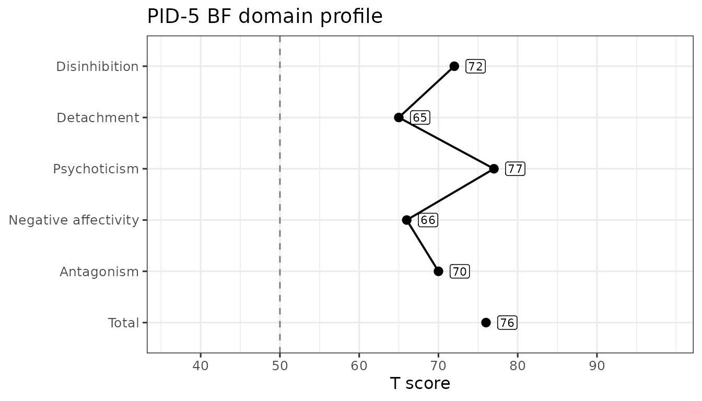

# Scoring the PID-5-BF

``` r

library(hitop)
```

The PID-5-BF (Brief Form) is a 25-item version of the PID-5 that yields
the 5 personality-trait domain scores and an overall total score (it
does not produce the 25 facet scores). We can demonstrate the package’s
functionality using some simulated data.

## Score simulated PID-5-BF data

The `sim_pid5bf` dataset is built into the package and contains 100 rows
(each a simulated participant) across 25 columns named `pid_1` to
`pid_25`. To compute the 5 domain scores and the total, we use
[`score_pid5()`](https://jmgirard.github.io/hitop/reference/score_pid5.md)
with `version = "BF"`. As with the other forms, we can specify the items
by column number (`items = 1:25`) and set `append = FALSE` to see just
the scores. The only validity scale calculable from this subset of items
is the percentage of missing items (PNA), which
[`validity_pid5()`](https://jmgirard.github.io/hitop/reference/validity_pid5.md)
returns.

The `pid_total` column is the mean of all 25 items, following Markon et
al. (2024, p. 23). Note that this is *not* the same as averaging the 5
domain scores whenever any items are missing: each scale applies the
`missing` rule to its own items, so the total tolerates up to 6
unanswered items while a 5-item domain tolerates only 1. See
[`?score_pid5`](https://jmgirard.github.io/hitop/reference/score_pid5.md)
for the details.

``` r

data("sim_pid5bf")

score_pid5(sim_pid5bf, items = 1:25, version = "BF", append = FALSE)
#> # A tibble: 100 × 6
#>    pid_disinhibition pid_detachment pid_psychoticism pid_negativeAffectivity
#>                <dbl>          <dbl>            <dbl>                   <dbl>
#>  1               1.8            1.6              2                       1.8
#>  2               2.2            2.2              2.2                     1.4
#>  3               2.4            1.2              1.8                     1.6
#>  4               2.4            2.2              0.8                     0.8
#>  5               2.2            1.2              1.4                     2.8
#>  6               1.8            0.6              2.2                     1.2
#>  7               1              2                1.6                     1.4
#>  8               1.4            1.8              1.2                     1.8
#>  9               1.6            0.8              2.2                     0.8
#> 10               1.2            1.8              1.4                     0.6
#> # ℹ 90 more rows
#> # ℹ 2 more variables: pid_antagonism <dbl>, pid_total <dbl>

validity_pid5(sim_pid5bf, items = 1:25, version = "BF", append = FALSE)
#> # A tibble: 100 × 1
#>    pid_PNA
#>      <dbl>
#>  1       0
#>  2       0
#>  3       0
#>  4       0
#>  5       0
#>  6       0
#>  7       0
#>  8       0
#>  9       0
#> 10       0
#> # ℹ 90 more rows
```

## Scale Reliability

As we compute scale scores, we can also estimate their inter-item
reliability using Cronbach’s α (alpha) or McDonald’s ω (omega total). α
is fast and widely used, but it assumes tau-equivalence (all items load
equally on a single factor); violations can make α under- or
over-estimate reliability. ω is based on a congeneric single-factor
model, allowing items to have different loadings and error variances; it
typically provides a more accurate reliability estimate for
unit-weighted sums. Both assume the scale is essentially unidimensional;
α and ω coincide when tau-equivalence holds.

We estimate reliability with the
[`reliability_pid5()`](https://jmgirard.github.io/hitop/reference/reliability_pid5.md)
function, which returns a tibble with one row per scale: its printed
name (`Scale`), the stem that names its column in the scored output
(`camelCase`), the number of items (`nItems`), and the requested
coefficients. By default it computes both `alpha` and `omega`; for the
latter, we will need the **lavaan** package installed (set
`omega = FALSE` to skip it). Note that, because this is naively
simulated data, we would expect the reliability in this example to be
poor.

``` r

reliability_pid5(
  data = sim_pid5bf,
  items = 1:25,
  version = "BF"
)
#> # A tibble: 6 × 5
#>   Scale                camelCase           nItems   alpha    omega
#>   <chr>                <chr>                <int>   <dbl>    <dbl>
#> 1 Disinhibition        disinhibition            5 -0.260  0.00111 
#> 2 Detachment           detachment               5  0.238  0.365   
#> 3 Psychoticism         psychoticism             5  0.0658 0.0863  
#> 4 Negative affectivity negativeAffectivity      5 -0.0852 0.000422
#> 5 Antagonism           antagonism               5 -0.0967 0.105   
#> 6 Total                total                   25 -0.0719 0.0575
```

## Normative Scores

The `pid_norms` dataset carries the normative score distributions
published by Markon et al. (2024), including a set built on the brief
form. The
[`norm_pid5()`](https://jmgirard.github.io/hitop/reference/norm_pid5.md)
function looks scored columns up in those tables and returns, for each
one, the T score and percentile printed against the nearest tabled raw
score. It converts scores rather than computing them, so we hand it the
output of
[`score_pid5()`](https://jmgirard.github.io/hitop/reference/score_pid5.md).

The brief-form tables cover the five domain scales and the total score —
every scale `score_pid5(version = "BF")` returns — so each column here
gains both a `_t` and a `_ptl` column.

``` r

scored <- score_pid5(sim_pid5bf, items = 1:25, version = "BF")

norm_pid5(
  scored,
  scores = paste0(
    "pid_",
    c("negativeAffectivity", "detachment", "antagonism", "disinhibition",
      "psychoticism", "total")
  ),
  version = "BF",
  append = FALSE
)
#> # A tibble: 100 × 12
#>    pid_negativeAffectivity_t pid_negativeAffectivity_ptl pid_detachment_t
#>                        <int>                       <dbl>            <int>
#>  1                        66                        0.9                65
#>  2                        60                        0.81               74
#>  3                        63                        0.86               58
#>  4                        51                        0.56               74
#>  5                        81                        0.99               58
#>  6                        57                        0.74               49
#>  7                        60                        0.81               71
#>  8                        66                        0.9                68
#>  9                        51                        0.56               52
#> 10                        48                        0.47               68
#> # ℹ 90 more rows
#> # ℹ 9 more variables: pid_detachment_ptl <dbl>, pid_antagonism_t <int>,
#> #   pid_antagonism_ptl <dbl>, pid_disinhibition_t <int>,
#> #   pid_disinhibition_ptl <dbl>, pid_psychoticism_t <int>,
#> #   pid_psychoticism_ptl <dbl>, pid_total_t <int>, pid_total_ptl <dbl>
```

Every number returned is a cell of a published table: the nearest
printed row is selected and nothing is interpolated. A score that falls
outside a printed range is capped to the nearest end rather than
extrapolated, and a warning reports how many observations that happened
to. Every report this function makes is a warning, so a single
[`suppressWarnings()`](https://rdrr.io/r/base/warning.html) call
silences it. Note that `version = "BF"` selects the brief-form tables —
the same raw score converts differently across forms.

If the items were answered on a four-option response scale that starts
somewhere other than 0 — 1 to 4, say — pass that range as `srange` and
each score is reconciled to the published 0–3 metric before it is looked
up, with a warning naming which scales were adjusted and which were left
alone. The per-scale formulas are given in
[`?norm_pid5`](https://jmgirard.github.io/hitop/reference/norm_pid5.md).

## Profile Plots

Once a respondent’s scores are normed,
[`plot_pid5()`](https://jmgirard.github.io/hitop/reference/plot_pid5.md)
draws them as a profile against the published metric. It takes one
respondent — a profile plot shows one person — so we norm the whole
dataset and hand it a single row. Passing `version = "BF"` builds the
plot against the brief form’s own tables.

``` r

bf_scales <- paste0("pid_", pid_scales[["BF"]]$camelCase)
normed <- norm_pid5(scored, scores = bf_scales, version = "BF")
```

``` r

plot_pid5(normed[1, ], version = "BF")
```



All six brief-form scales get a point, but the profile line stops before
`total`: the total is an overall elevation across the five domains
rather than a sixth domain, so joining it to the line would imply a
comparability it does not have. The point itself is still drawn, so the
elevation is readable alongside the domains it summarizes.

The dashed line marks T = 50, the normative sample’s mean, and the score
axis spans the range the published brief-form tables actually print for
these scales — so the axis does not rescale from respondent to
respondent and two brief-form profiles are directly comparable. Nothing
on the plot says whether a score is high, low, or concerning: {hitop}
presents scores against norms and leaves the interpreting to you.

There is no facet profile for this form. The brief form’s 25 items yield
the five domains and the total and no facet scores at all, so
`level = "facet"` is an error here rather than an empty plot; facet
profiles are available for the full and short forms. Set
`metric = "percentile"` for a percentile axis instead of T scores; the
full-form vignette shows one. The result is an ordinary ggplot object,
so you can restyle it with any ggplot2 layer.
