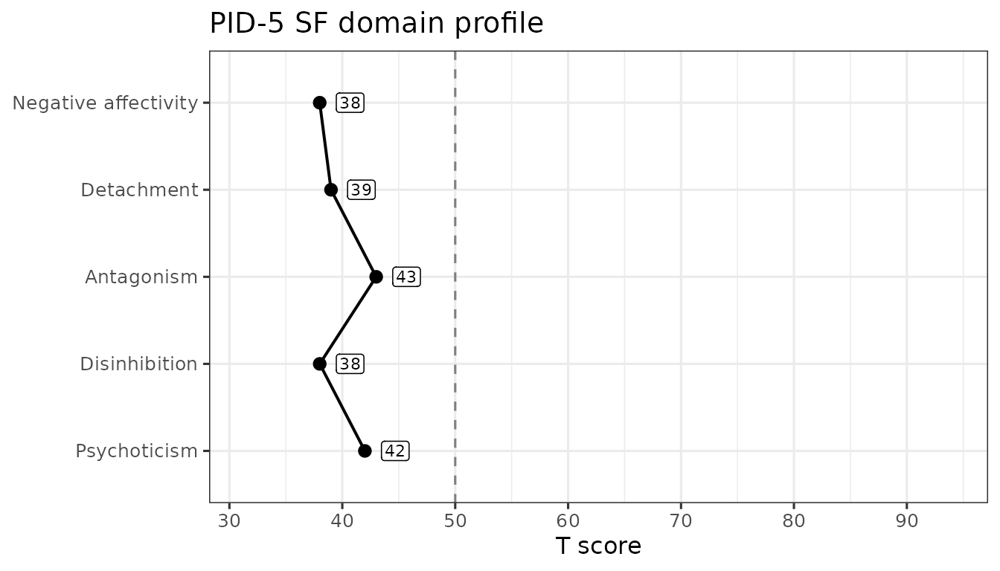
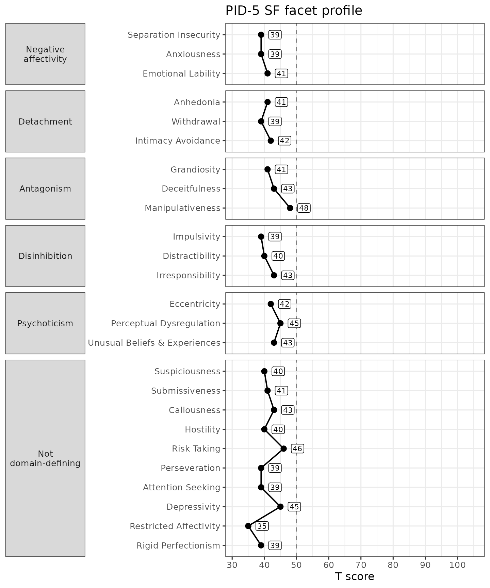

# Scoring the PID-5-SF

``` r

library(hitop)
```

## Score simulated PID-5-SF data

The PID-5-SF is a shorter version of the PID-5 with 100 items that still
yields all domain and facet scores. The validity scales are still
calculable but may have fewer items and their psychometric properties
have not, to my knowledge, been examined with the FSF.

``` r

data("sim_pid5sf")

score_pid5(sim_pid5sf, items = 1:100, version = "SF", append = FALSE)
#> # A tibble: 100 × 30
#>    pid_suspiciousness pid_impulsivity pid_submissiveness pid_callousness
#>                 <dbl>           <dbl>              <dbl>           <dbl>
#>  1               1.5             1.5                1               2.25
#>  2               2               1.25               1               2   
#>  3               0.5             1.5                1.25            1.5 
#>  4               2               1                  2               1.25
#>  5               2.75            0.75               1               1.25
#>  6               0.75            1.5                2.75            1.5 
#>  7               0.75            0                  1.75            1   
#>  8               0.5             0.75               1               2.25
#>  9               2.25            1.75               2               1.5 
#> 10               1               1.25               1.75            1.5 
#> # ℹ 90 more rows
#> # ℹ 26 more variables: pid_anhedonia <dbl>, pid_eccentricity <dbl>,
#> #   pid_hostility <dbl>, pid_riskTaking <dbl>, pid_grandiosity <dbl>,
#> #   pid_perceptualDysregulation <dbl>, pid_separationInsecurity <dbl>,
#> #   pid_deceitfulness <dbl>, pid_perseveration <dbl>,
#> #   pid_attentionSeeking <dbl>, pid_anxiousness <dbl>, pid_depressivity <dbl>,
#> #   pid_withdrawal <dbl>, pid_restrictedAffectivity <dbl>, …

validity_pid5(sim_pid5sf, items = 1:100, version = "SF", append = FALSE)
#> ! A total of 96 observations (96.0%) met criteria for inconsistent responding on the INCS (0 missing).
#> ℹ Consider removing them with `dplyr::filter(df, pid_INCS < 8)`
#> ! Cut scores for the ORS-S, PRD-S, and SDTD-S have not been developed.
#> # A tibble: 100 × 5
#>    pid_PNA pid_INCS pid_ORSS pid_PRDS pid_SDTDS
#>      <dbl>    <dbl>    <dbl>    <dbl>     <dbl>
#>  1       0       11        2       26        19
#>  2       0       14        3       17        10
#>  3       0       13        1       14        11
#>  4       0       16        3       26        16
#>  5       0        9        3       11         8
#>  6       0       15        2       21        13
#>  7       0       15        4       16        11
#>  8       0       17        1       28        11
#>  9       0       15        1       18        16
#> 10       0       15        1       16        10
#> # ℹ 90 more rows
```

## Score real PID-5-SF data

We can repeat this process with real data that was collected at
University of Kansas (KU). There should be fewer (but still some)
validity problems since this is real data. We can also retain un-scored
“ID” variables in the dataset.

``` r

data("ku_pid5sf")

score_pid5(
  ku_pid5sf,
  items = paste0("pid_", 1:100),
  version = "SF",
  append = FALSE
)
#> # A tibble: 386 × 30
#>    pid_suspiciousness pid_impulsivity pid_submissiveness pid_callousness
#>                 <dbl>           <dbl>              <dbl>           <dbl>
#>  1               0               0                  0.5             0   
#>  2               0.5             0.25               1.5             0.5 
#>  3               1.75            1.75               2               1.75
#>  4               0.25            1                  0               0.25
#>  5               1.5             2.5                2               0.5 
#>  6               0.75            0.75               0.75            0   
#>  7               1.5             0.75               0.75            0.25
#>  8               0               0.25               1.25            0   
#>  9               0               0                  2.25            0   
#> 10               0.5             0.5                2.5             0.75
#> # ℹ 376 more rows
#> # ℹ 26 more variables: pid_anhedonia <dbl>, pid_eccentricity <dbl>,
#> #   pid_hostility <dbl>, pid_riskTaking <dbl>, pid_grandiosity <dbl>,
#> #   pid_perceptualDysregulation <dbl>, pid_separationInsecurity <dbl>,
#> #   pid_deceitfulness <dbl>, pid_perseveration <dbl>,
#> #   pid_attentionSeeking <dbl>, pid_anxiousness <dbl>, pid_depressivity <dbl>,
#> #   pid_withdrawal <dbl>, pid_restrictedAffectivity <dbl>, …

validity_pid5(
  ku_pid5sf,
  items = paste0("pid_", 1:100),
  version = "SF",
  append = FALSE
)
#> ! A total of 51 observations (13.2%) met criteria for inconsistent responding on the INCS (5 missing).
#> ℹ Consider removing them with `dplyr::filter(df, pid_INCS < 8)`
#> ! Cut scores for the ORS-S, PRD-S, and SDTD-S have not been developed.
#> # A tibble: 386 × 5
#>    pid_PNA pid_INCS pid_ORSS pid_PRDS pid_SDTDS
#>      <dbl>    <dbl>    <dbl>    <dbl>     <dbl>
#>  1       0        0        0        0         0
#>  2       0        2        0        7         7
#>  3       0        9        0       22        14
#>  4       0        4        1       10        14
#>  5       0        3        1       13         9
#>  6       0        6        0        3         3
#>  7       0        5        0       10         8
#>  8       0        4        0        2         5
#>  9       0        5        0        5         5
#> 10       0        7        0       14         7
#> # ℹ 376 more rows
```

## Simple Standard Errors (deprecated)

The `calc_se` argument is **deprecated**. It, and the `_se` columns it
adds, will be removed in a future release, and the call below warns
because it passes `calc_se = TRUE`. This package has no interval
function for the PID-5, so there is no replacement for it on this
instrument; for measurement precision, see the reliability coefficients
below.

What the argument computes, while it lasts: for the 25 facets, this is
the SD of the items the respondent actually answered divided by the
square root of how many of those items they answered. The 5 domain
scores are means of three facet scores rather than means of items, so
their standard errors are taken one level up: the SD of the three
contributing facet scores divided by the square root of 3. A standard
error is `NA` wherever its scale score is `NA`.

Note what these numbers do and do not describe. Each one summarizes how
much a respondent’s answers varied within a scale; it is not an estimate
of how precisely the scale measures the underlying trait, so it does not
give a confidence interval for a respondent’s true score.

``` r

score_pid5(
  ku_pid5sf,
  items = paste0("pid_", 1:100),
  version = "SF",
  calc_se = TRUE,
  append = FALSE
)
#> Warning in score_pid5(ku_pid5sf, items = paste0("pid_", 1:100), version = "SF", : The `calc_se` argument is deprecated.
#> ℹ It, and the `_se` columns it adds, will be removed in a future release.
#> ℹ This package has no interval function for the PID-5; for measurement
#>   precision see `reliability_pid5()`.
#> # A tibble: 386 × 60
#>    pid_suspiciousness pid_impulsivity pid_submissiveness pid_callousness
#>                 <dbl>           <dbl>              <dbl>           <dbl>
#>  1               0               0                  0.5             0   
#>  2               0.5             0.25               1.5             0.5 
#>  3               1.75            1.75               2               1.75
#>  4               0.25            1                  0               0.25
#>  5               1.5             2.5                2               0.5 
#>  6               0.75            0.75               0.75            0   
#>  7               1.5             0.75               0.75            0.25
#>  8               0               0.25               1.25            0   
#>  9               0               0                  2.25            0   
#> 10               0.5             0.5                2.5             0.75
#> # ℹ 376 more rows
#> # ℹ 56 more variables: pid_anhedonia <dbl>, pid_eccentricity <dbl>,
#> #   pid_hostility <dbl>, pid_riskTaking <dbl>, pid_grandiosity <dbl>,
#> #   pid_perceptualDysregulation <dbl>, pid_separationInsecurity <dbl>,
#> #   pid_deceitfulness <dbl>, pid_perseveration <dbl>,
#> #   pid_attentionSeeking <dbl>, pid_anxiousness <dbl>, pid_depressivity <dbl>,
#> #   pid_withdrawal <dbl>, pid_restrictedAffectivity <dbl>, …
```

Note how there are now 60 columns instead of 30. The extra columns
aren’t all shown in the preview above, but they are named with the `_se`
suffix, e.g., `pid_anhedonia_se`.

## Scale Reliability

As we compute scale scores, we can also estimate their inter-item
reliability using Cronbach’s α (alpha) or McDonald’s ω (omega total). α
is fast and widely used, but it assumes tau-equivalence (all items load
equally on a single factor); violations can make α under- or
over-estimate reliability. ω is based on a congeneric single-factor
model, allowing items to have different loadings and error variances; it
typically provides a more accurate reliability estimate for
unit-weighted sums. Both assume the scale is essentially unidimensional;
α and ω coincide when tau-equivalence holds.

We estimate reliability with the
[`reliability_pid5()`](https://jmgirard.github.io/hitop/reference/reliability_pid5.md)
function, which returns a tibble with one row per scale and columns for
the number of items and the requested coefficients. By default it
computes both `alpha` and `omega`; for the latter, we will need the
**lavaan** package installed (set `omega = FALSE` to skip it).

``` r

reliability_pid5(
  data = ku_pid5sf,
  items = sprintf("pid_%d", 1:100),
  version = "SF"
)
#> # A tibble: 25 × 4
#>    Scale                    nItems alpha omega
#>    <chr>                     <int> <dbl> <dbl>
#>  1 Suspiciousness                4 0.663 0.665
#>  2 Impulsivity                   4 0.804 0.808
#>  3 Submissiveness                4 0.818 0.818
#>  4 Callousness                   4 0.816 0.816
#>  5 Anhedonia                     4 0.864 0.865
#>  6 Eccentricity                  4 0.832 0.833
#>  7 Hostility                     4 0.748 0.762
#>  8 Risk Taking                   4 0.782 0.785
#>  9 Grandiosity                   4 0.763 0.772
#> 10 Perceptual Dysregulation      4 0.690 0.689
#> # ℹ 15 more rows
```

## Normative Scores

The `pid_norms` dataset carries the normative score distributions
published by Markon et al. (2024), including a set built on the short
form. The
[`norm_pid5()`](https://jmgirard.github.io/hitop/reference/norm_pid5.md)
function looks scored columns up in those tables and returns, for each
one, the T score and percentile printed against the nearest tabled raw
score. It converts scores rather than computing them, so we hand it the
output of
[`score_pid5()`](https://jmgirard.github.io/hitop/reference/score_pid5.md)
— and of
[`validity_pid5()`](https://jmgirard.github.io/hitop/reference/validity_pid5.md),
if we want those scales converted too.

``` r

scored <- score_pid5(ku_pid5sf, items = paste0("pid_", 1:100), version = "SF")
scored <- validity_pid5(scored, items = paste0("pid_", 1:100), version = "SF")
```

For the short form the published tables cover the five domain scales,
all 25 facet scales, and the INC-S inconsistency scale. Each converted
scale gains a `_ptl` column, and those whose tables print T scores also
gain a `_t` column. INC-S is distributed as percentiles only, so it gets
no `_t` column. Note that `version = "SF"` selects the short-form tables
— the same raw score converts differently across forms.

``` r

norm_pid5(
  scored,
  scores = paste0(
    "pid_",
    c("negativeAffectivity", "detachment", "antagonism", "disinhibition",
      "psychoticism", "INCS")
  ),
  version = "SF",
  append = FALSE
)
#> Warning: ! 0 observations below and 6 above the printed range were capped to the nearest
#>   printed row.
#> ℹ A capped score's T and percentile are the end row's printed values, not an
#>   extrapolation.
#> # A tibble: 386 × 11
#>    pid_negativeAffectivity_t pid_negativeAffectivity_ptl pid_detachment_t
#>                        <int>                       <dbl>            <int>
#>  1                        38                        0                  39
#>  2                        63                        0.89               59
#>  3                        65                        0.89               68
#>  4                        54                        0.72               74
#>  5                        53                        0.67               55
#>  6                        51                        0.58               42
#>  7                        56                        0.76               59
#>  8                        53                        0.67               43
#>  9                        50                        0.58               48
#> 10                        72                        0.97               64
#> # ℹ 376 more rows
#> # ℹ 8 more variables: pid_detachment_ptl <dbl>, pid_antagonism_t <int>,
#> #   pid_antagonism_ptl <dbl>, pid_disinhibition_t <int>,
#> #   pid_disinhibition_ptl <dbl>, pid_psychoticism_t <int>,
#> #   pid_psychoticism_ptl <dbl>, pid_INCS_ptl <dbl>
```

Every number returned is a cell of a published table: the nearest
printed row is selected and nothing is interpolated. A score that falls
outside a printed range is capped to the nearest end rather than
extrapolated, and a warning reports how many observations that happened
to. A scale the tables do not cover returns `NA` in both columns with a
warning naming it. Every report this function makes is a warning, so a
single [`suppressWarnings()`](https://rdrr.io/r/base/warning.html) call
silences it.

If the items were answered on a four-option response scale that starts
somewhere other than 0 — 1 to 4, say — pass that range as `srange` and
each score is reconciled to the published 0–3 metric before it is looked
up, with a warning naming which scales were adjusted and which were left
alone. The per-scale formulas are given in
[`?norm_pid5`](https://jmgirard.github.io/hitop/reference/norm_pid5.md).

## Profile Plots

Once a respondent’s scores are normed,
[`plot_pid5()`](https://jmgirard.github.io/hitop/reference/plot_pid5.md)
draws them as a profile against the published metric. It takes one
respondent — a profile plot shows one person — so we norm the whole
dataset and hand it a single row. Passing `version = "SF"` builds the
plot against the short form’s own tables.

``` r

domains <- paste0(
  "pid_",
  c("negativeAffectivity", "detachment", "antagonism", "disinhibition",
    "psychoticism")
)
normed <- norm_pid5(scored, scores = domains, version = "SF")
```

``` r

plot_pid5(normed[1, ], version = "SF")
```



The dashed line marks T = 50, the normative sample’s mean, and the score
axis spans the range the published short-form tables actually print for
these scales — so the axis does not rescale from respondent to
respondent and two short-form profiles are directly comparable. Nothing
on the plot says whether a score is high, low, or concerning: {hitop}
presents scores against norms and leaves the interpreting to you.

The short form scores all 25 facets, so `level = "facet"` plots those
instead, grouped into a panel per domain. The APA key ties three facets
to each domain; the remaining ten define no domain and are grouped
separately rather than dropped.

``` r

facets <- paste0("pid_", pid_scales[["SF"]]$camelCase)
normed_facets <- norm_pid5(scored, scores = facets, version = "SF")
plot_pid5(normed_facets[1, ], version = "SF", level = "facet")
```



Set `metric = "percentile"` for a percentile axis instead of T scores;
the full-form vignette shows one. The result is an ordinary ggplot
object, so you can restyle it with any ggplot2 layer.
